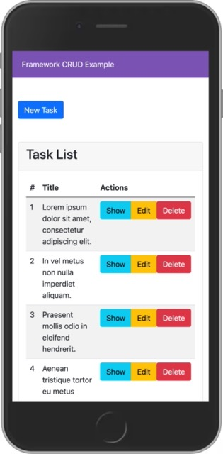
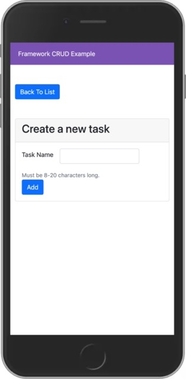
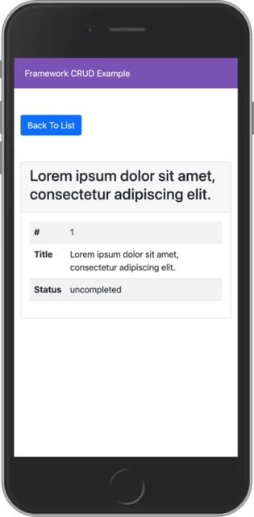
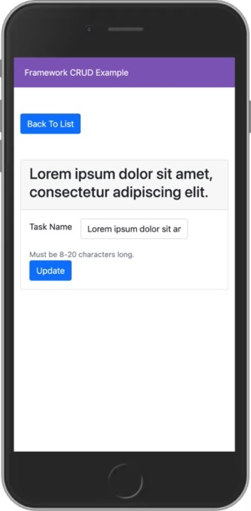

# Spiral Framework CRUD

- Spiral Framework. https://spiral.dev/
- Twig template engine: https://twig.symfony.com. All the templates are used from memory cache.
- Overriding HTTP method to support 'HEAD', 'PUT', 'DELETE', 'CONNECT', 'OPTIONS', 'PATCH', 'PURGE', 'TRACE' methods that are not support by HTML form. For more info -> https://github.com/symfony/http-foundation/blob/6.1/Request.php#L1194

## Installation
    mkdir spiral-framework-database-crud
    cd spiral-framework-database-crud
    git clone git@github.com:mahmutbayri/spiral-framework-database-crud.git .
    composer install
    php app.php migrate:init
    php app.php db:table migrations
    php app.php migrate -vv
    php app.php db:list

## Live demo

http://3.68.213.252:3000/tasks

> Depending on when your visit the address might not work.

## Running on local

> You need to have the RoadRunner binary file https://roadrunner.dev/docs/intro-install/2.x/en

    ./rr serve

Navigate: http://localhost:3000/tasks

## Running on local with docker

### Test
    docker run \
    -e X_LISTEN=0.0.0.0:3000 \
    --rm --name my-running-script \
    -v "$PWD":/var/www/html \
    -p 3000:3000 \
    -w /var/www/html \
    php:8.2-cli \
    sh -c "docker-php-ext-install sockets pdo_mysql && docker-php-ext-enable sockets pdo_mysql && ./php-8-binary-rr serve"
### Prod

    docker image rm -f spiral-framework-database-crud && docker build -t spiral-framework-database-crud --file DockerfileProd .
    docker container rm -f spiral-framework-database-crud-container && sleep 3 && docker run --name spiral-framework-database-crud-container -d -p 3000:3000 spiral-framework-database-crud

    // Clean up
    docker container rm -f spiral-framework-database-crud-container
    docker image rm -f spiral-framework-database-crud

Navigate: http://localhost:3000/tasks

## Performance
On a AWS Fargate task, 	1 vCPU	2 GB

    hey -n 5000 -c 100 URL

| URL                                | Requests/sec |
|------------------------------------|--------------|
| http://localhost:3000/tasks        | 1118         |
| http://localhost:3000/tasks/create | 1289         |
| http://localhost:3000/tasks/1      | 1193         |
| http://localhost:3000/tasks/1/edit | 1181         |

## Screenshots

### List the tasks

http://localhost:3000/tasks

### Create a task
http://localhost:3000/tasks/create

### Show a task
http://localhost:3000/tasks/1

### Edit a task
http://localhost:3000/tasks/1/edit

